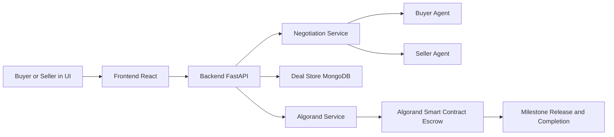
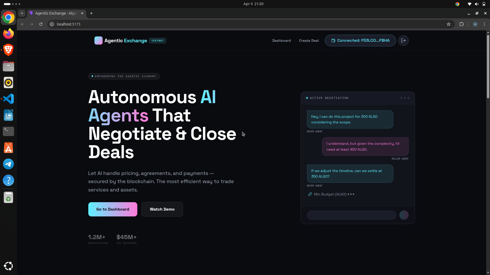

# Agentic Exchange

## 1. Project Title and Tagline
AI agents negotiate. Algorand secures. Commerce executes itself.

## Quick Snapshot (One-Scroll Summary)
- Team Name: BROTHERHOOD
- Team Members: Rohan Kumar, Abhishek Singh
- Hackathon: AlgoBharat Hack Series 3.0 (Round 2)
- Track: Agentic Commerce (AI + Blockchain)
- What we built:
  A full-stack marketplace where buyer and seller AI agents autonomously negotiate price, milestones, and deadlines, then execute the agreement through Algorand smart contract escrow with milestone-based payout.
- Core flow:
  UI -> AI negotiation -> smart contract escrow -> milestone execution -> deal completion

## 2. Team Information
- Team Name: BROTHERHOOD
- Team Members:
  - Rohan Kumar
  - Abhishek Singh
- Hackathon: AlgoBharat Hack Series 3.0 (Round 2)
- Track: Agentic Commerce (AI + Blockchain)

## 3. Problem Statement
Traditional freelance/service marketplaces still rely on manual negotiation and weak trust guarantees.

Pain points:
- Users spend too much time negotiating terms manually.
- Unknown counterparties create trust friction.
- Payment disputes happen due to weak milestone enforcement.
- End-to-end execution lacks transparent verification.

## 4. Solution Overview
Agentic Exchange automates the complete deal lifecycle:
- User creates a deal request with budget, scope, and deadline constraints.
- Buyer and seller AI agents negotiate terms in natural language.
- Negotiated terms are converted into blockchain-backed escrow logic.
- Funds are held and released only as milestones are validated.

Outcome: faster deal closure, trustless settlement, and reduced disputes.

## 5. Core Innovation
- Autonomous negotiation between specialized buyer and seller agents.
- Human-like conversational bargaining for price, scope, and timelines.
- Smart contract escrow to enforce milestone-based payment rules.
- Single, fully working core flow optimized for real-world utility.

## 6. How It Works (Step-by-step)
1. Buyer creates a deal in the frontend UI.
2. Seller accepts and enters negotiation.
3. AI agents conduct multi-turn negotiation.
4. Both parties approve the negotiated result.
5. Backend generates on-chain transaction payloads.
6. Buyer creates and funds escrow on Algorand.
7. Seller confirms participation on-chain.
8. Buyer releases milestone payments as delivery is verified.
9. Deal is finalized after all milestones are settled.

## 7. System Architecture

### Architecture Diagram (Mermaid)


### Execution Path
Frontend captures user intent and wallet actions, backend orchestrates negotiation and deal state, and smart contract escrow enforces financial execution.

## 8. Tech Stack
- Frontend: React, Vite, Tailwind CSS
- Backend: FastAPI, Python
- AI Layer: Buyer Agent, Seller Agent, Negotiation Engine
- Blockchain: Algorand TestNet
- Smart Contract: PyTeal
- Database: MongoDB

## 9. Algorand Integration

Why Algorand:
- Low fees make milestone-level payments practical.
- Fast finality improves settlement confidence.
- Reliable performance suits autonomous commerce workflows.

How Algorand is used:
- Smart contract escrow locks deal funds.
- On-chain acceptance confirms participants.
- Milestone release controls progressive payout.
- Completion state proves final execution.

Wallet integration:
- Pera wallet connection is used for user authentication and signing.
- Critical financial operations are signed by users from the frontend.

On-chain verification links:
- Pera Explorer (Application): https://explorer.perawallet.app/application/758126516/
- Pera Explorer (Application Address): https://explorer.perawallet.app/address/JUSRQVITC54J3NTYZXEPLXNC6RLKYSWGPCIIVJQ2SLJJRN2Y2FQBA5IK4A/
- AlgoExplorer TestNet (Application): https://testnet.algoexplorer.io/application/758126516
- AlgoExplorer TestNet (Address): https://testnet.algoexplorer.io/address/JUSRQVITC54J3NTYZXEPLXNC6RLKYSWGPCIIVJQ2SLJJRN2Y2FQBA5IK4A

## 10. Hackathon Requirement Alignment
- Full-stack implementation:
  Frontend + backend + blockchain smart contract are fully integrated.
- End-to-end flow:
  UI -> AI negotiation -> smart contract -> execution is implemented.
- Real Algorand integration:
  Escrow and settlement actions run on Algorand TestNet.
- Focused core flow:
  Autonomous negotiation + escrow deal execution is complete and demonstrable.

## 11. Demo Instructions (Run Locally)

Prerequisites:
- Python 3.10+
- Node.js 18+
- npm
- Algorand TestNet wallet (Pera)

### A) Run Backend
```bash
pip install -r requirements.txt
```

Create .env at project root:
```env
GEMINI_API_KEY=your_gemini_key
MONGODB_URI=your_mongo_uri
MONGODB_DB=agentic_exchange
ALGOD_ADDRESS=https://testnet-api.algonode.cloud
ALGOD_TOKEN=
APP_ID=758126516
CONTRACT_BOX_FUNDING=160000
```

Start backend from project root:
```bash
uvicorn backend.main:app --reload
```

### B) Run Frontend
```bash
cd frontend
npm install
npm run dev
```

### C) Test Negotiation API
```bash
curl -X POST http://127.0.0.1:8000/start-negotiation \
  -H "Content-Type: application/json" \
  -d "{\"deal_id\":\"<deal_id>\"}"
```

### D) Simulate Full Deal Flow
1. Create deal from UI.
2. Seller accepts deal.
3. Start AI negotiation and approve terms.
4. Buyer creates and funds escrow on-chain.
5. Seller performs on-chain accept.
6. Buyer releases milestone funds.
7. Mark deal as complete.

## 12. Demo Video
- Demo Link: https://youtu.be/your-demo-link

## 13. Project Structure
```text
frontend/         # React UI and wallet integration
backend/          # FastAPI routes, schemas, services
Agents/           # AI agents and negotiation engine
smart_contract/   # PyTeal contract and deployment scripts
```

Naming note:
- agents/ in docs corresponds to Agents/ in this repo.
- contracts/ in docs corresponds to smart_contract/ in this repo.

## 14. Future Scope
- Fully autonomous agents with long-term memory and strategy adaptation.
- DAO-based dispute resolution for contested milestones.
- Multi-agent service marketplaces with specialist agents.
- Cross-chain payment execution with Algorand escrow anchor.

## 15. Why This Project Matters
Agentic Exchange proves a practical model for autonomous commerce:
- AI handles negotiation overhead.
- Blockchain enforces trust and payment discipline.
- Milestone escrow protects both buyers and sellers.
- Full-stack execution demonstrates real implementation, not just concept.

## Screenshots
Add your images under docs/images and reference them below.

```md



```
