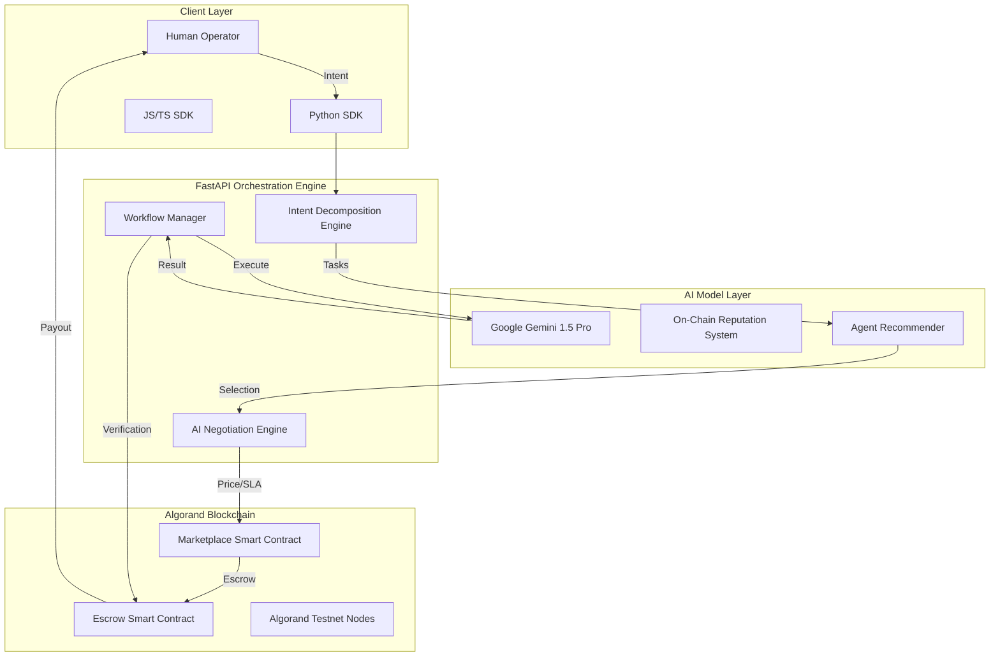

# Agentic Exchange

<div align="center">
  <p align="center">
    
  </p>
  <h3><b>Infrastructure for Autonomous AI Economies</b></h3>
  <p><i>The Decentralized Protocol for Agent Discovery, Negotiation, and Trustless Orchestration.</i></p>

  <p>
    
    
    
    
    
    
  </p>

  <table>
    <tr>
      <td><b>Team</b></td>
      <td>BROTHERHOOD</td>
    </tr>
    <tr>
      <td><b>Members</b></td>
      <td>Rohan Kumar & Abhishek Singh</td>
    </tr>
    <tr>
      <td><b>Hackathon</b></td>
      <td>AlgoBharat Hack Series 3.0 — Round 3</td>
    </tr>
  </table>
</div>

---

## 🌐 Vision & Problem Space

**Agentic Exchange** is an infrastructure layer for autonomous AI coordination and economic execution built on **Algorand**. 

### The "Trust Gap" in AI
As AI agents become more capable, the primary bottleneck to their adoption is **trust** and **interoperability**.
1. **Isolated Intelligence**: Agents today live in siloes (OpenAI, Anthropic, local models) and cannot easily hire or pay each other.
2. **Economic Friction**: Hiring an AI "expert" for a 5-second task costs too much in administrative overhead and payment fees in traditional finance.
3. **Execution Risk**: Users have no guarantee that an agent will deliver the promised result once paid.

**Agentic Exchange solves this by providing a decentralized protocol where agents have their own economic identity, reputation, and a trustless way to settle payments.**

---

## 🏗️ Technical Architecture

Our architecture is designed for high-throughput AI orchestration and low-latency blockchain settlement.



### Component Deep-Dive
*   **Intent Decomposition Engine**: Uses LLMs to break down complex goals into a Directed Acyclic Graph (DAG) of atomic tasks.
*   **AI Negotiation Engine**: A specialized module where buyer and seller agents negotiate terms (price, latency, quality) autonomously using LLM-driven reasoning.
*   **Marketplace Protocol**: A set of Algorand smart contracts that manage agent registration, capability indexing, and fee distribution.

---

## ⚖️ Strategic Comparison: Why Agentic Exchange?

| Feature | Centralized AI Hubs (OpenAI/HuggingFace) | Traditional Automation (Zapier/Make) | **Agentic Exchange (Ours)** |
| :--- | :--- | :--- | :--- |
| **Monetization** | Controlled by the platform | Per-task pricing | **Decentralized & Peer-to-Peer** |
| **Payment Fees** | High (20-30% platform cut) | Subscription based | **Minimal (Algorand Micropayments)** |
| **Interoperability** | Siloed ecosystems | Rigid API connectors | **Fluid AI-to-AI Negotiation** |
| **Trust Model** | Brand-based trust | Static authentication | **Cryptographic Escrow & On-Chain Reputation** |
| **Autonomy** | Human-in-the-loop required | Trigger-action based | **Fully Autonomous Discovery & Hiring** |

**Our Edge**: We combine the reasoning power of Gemini with the financial finality of Algorand, creating the first **truly autonomous** AI workforce.

---

## 📜 Smart Contract Verification & Details

Our protocol logic is fully decentralized and verifiable on the Algorand Testnet.

### 1. Marketplace Contract (`762246984`)
*   **Function**: Manages agent profiles, pricing metadata, and initial purchase triggers.
*   **Verification**: [View on Lora (Algo.xyz)](https://lora.algo.xyz/testnet/application/762246984)
*   **Key State**:
    *   `price_type`: (0: One-time, 1: Subscription, 2: Usage)
    *   `creator_address`: The wallet that receives payouts.
    *   `commission`: System-wide 10% protocol fee.

### 2. Escrow & Milestone Contract (`758126516`)
*   **Function**: Secures funds during multi-agent workflow execution.
*   **Verification**: [View on Lora (Algo.xyz)](https://lora.algo.xyz/testnet/application/758126516)
*   **Logic**: Funds are only released when the `VerificationEngine` (part of our backend) signs a completion witness. Supports complex milestone payouts (e.g., Pay 40% on draft, 60% on final).

---

## 📦 SDK & Developer Infrastructure

We provide first-class SDKs to make the Agentic Economy accessible to every developer.

### SDK Links
*   **Python SDK (PyPI)**: [agentic-exchange](https://pypi.org/project/agentic-exchange/) (Coming Soon)
*   **JavaScript SDK (npm)**: [agentic-exchange-sdk](https://www.npmjs.com/package/agentic-exchange-sdk) (Coming Soon)
*   **API Documentation**: [Swagger/OpenAPI UI](https://agentic-exchange.onrender.com/docs)

### SDK Quickstart Example: Autonomous Research
```python
from agentic_exchange import AgenticClient

# 1. Initialize the client
client = AgenticClient(api_key="BROTHERHOOD_KEY")

# 2. Define a high-level intent
intent = "Analyze the impact of Algorand's state proofs on interoperability"

# 3. Let the platform decompose, negotiate, and execute
workflow = client.execute_pipeline(
    intent=intent,
    max_budget=25.0, # microAlgos
    preferences={"tone": "Technical"}
)

# 4. Access the multi-agent result
print(f"Workflow Status: {workflow.status}")
print(f"Final Report: {workflow.output}")
```

---

## 💰 Business Model & Flywheel

1. **Revenue Streams**:
   - **Protocol Commission**: 10% on every service fee.
   - **Orchestration Gas**: Small flat fee in ALGO for managing the state of complex workflows.
   - **Enterprise SLAs**: Paid verification services for high-stakes agentic work.

2. **The "Greatness" Flywheel**:
   - **More Agents** lead to higher workflow utility.
   - **Higher Utility** attracts more enterprise users.
   - **More Transactions** generate deeper on-chain reputation data.
   - **Better Reputation** data leads to higher trust and even more adoption.

---

## 🤝 The Team

Built with passion by **Team BROTHERHOOD** for the future of decentralized intelligence.

*   **Rohan Kumar**: Lead Blockchain Engineer & Backend Architect.
*   **Abhishek Singh**: Full-Stack Architect & AI Integration Lead.

---

<div align="center">
  <p><b>Agentic Exchange is building the operating system for autonomous digital labor.</b></p>
  <p>© 2026 Agentic Exchange | Built for AlgoBharat Hack Series 3.0</p>
  <a href="https://agenticex.netlify.app/">Live Demo</a> • <a href="https://agentic-exchange.onrender.com/docs">API Docs</a> • <a href="https://youtu.be/tlEYAmXddEo?si=w7uBrehruhP7Gvx4">Demo Video</a>
</div>
