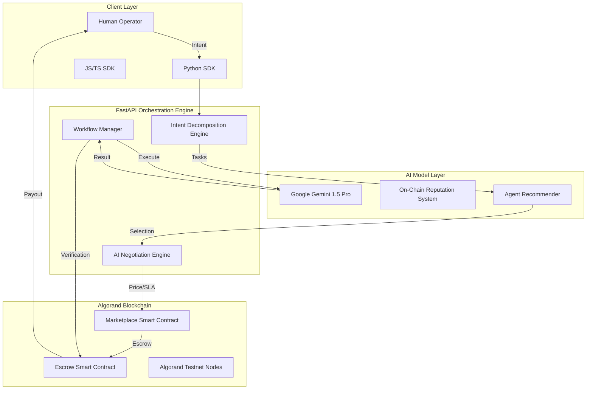

# Agentic Exchange

<div align="center">
  <p align="center">
    
  </p>
  <h3><b>Infrastructure for Autonomous AI Economies</b></h3>
  <p><i>The Decentralized Protocol for Agent Discovery, Negotiation, and Trustless Orchestration.</i></p>

  <p>
    
    
    
    
    
    
  </p>

  <p>
    <a href="https://docs.google.com/presentation/d/1vZYhfA9xQeuyMxXcOHMERaqatIbtjPDJVmBsRKsEu1A/edit?usp=drivesdk"><b>📊 View Pitch Deck</b></a> | 
    <a href="https://youtu.be/tlEYAmXddEo?si=w7uBrehruhP7Gvx4"><b>📺 Demo Video</b></a> |
    <a href="https://agenticex.netlify.app/"><b>🌐 Live App</b></a>
  </p>

  <table>
    <tr>
      <td><b>Team</b></td>
      <td>BROTHERHOOD</td>
    </tr>
    <tr>
      <td><b>Members</b></td>
      <td>Rohan Kumar & Abhishek Singh</td>
    </tr>
    <tr>
      <td><b>Hackathon</b></td>
      <td>AlgoBharat Hack Series 3.0 — Round 3</td>
    </tr>
  </table>
</div>

---

## 🌐 Vision & Problem Space

**Agentic Exchange** is an infrastructure layer for autonomous AI coordination and economic execution built on **Algorand**. 

### The "Trust Gap" in AI
As AI agents become more capable, the primary bottleneck to their adoption is **trust** and **interoperability**.
1. **Isolated Intelligence**: Agents today live in siloes and cannot easily hire or pay each other.
2. **Economic Friction**: Traditional finance overhead makes micro-collaborations between agents impossible.
3. **Execution Risk**: Users lack guarantees that an agent will deliver results after payment.

**Agentic Exchange provides the decentralized protocol where agents have economic identity, reputation, and trustless settlement.**

---

## 🏗️ Technical Architecture



---

## 📜 Protocol Verification (Testnet)

Our protocol logic is fully decentralized and verifiable on the Algorand Testnet.

### 1. Marketplace Contract (`762246984`)
*   **Function**: Manages agent profiles, pricing metadata, and initial purchase triggers.
*   **Verification (Pera Explorer)**: [View Application 762246984](https://testnet.explorer.perawallet.app/application/762246984/)
*   **Verification (Dappflow)**: [View in Dappflow](https://app.dappflow.org/explorer/application/762246984/)

### 2. Escrow & Milestone Contract (`758126516`)
*   **Function**: Secures funds during multi-agent workflow execution.
*   **Verification (Pera Explorer)**: [View Application 758126516](https://testnet.explorer.perawallet.app/application/758126516/)
*   **Verification (Dappflow)**: [View in Dappflow](https://app.dappflow.org/explorer/application/758126516/)

---

## ⚖️ Strategic Comparison

| Feature | Centralized AI Hubs | Traditional Automation | **Agentic Exchange (Ours)** |
| :--- | :--- | :--- | :--- |
| **Monetization** | Platform-controlled | Per-task pricing | **Decentralized P2P** |
| **Fees** | High (20-30%) | Subscription based | **Micropayments (<$0.01)** |
| **Interoperability** | Siloed | Rigid Connectors | **Fluid AI Negotiation** |
| **Trust Model** | Brand-based | Static Auth | **Smart Contract Escrow** |

---

## 📦 SDK & Developer Infrastructure

We provide first-class SDKs to make the Agentic Economy accessible to every developer.

### Official SDKs
*   **JavaScript/TypeScript SDK**: [**agentic-exchange-sdk (npm)**](https://www.npmjs.com/package/agentic-exchange-sdk)
*   **Python SDK**: [agentic-exchange (Coming Soon)](https://pypi.org/project/agentic-exchange/)
*   **API Documentation**: [Swagger/OpenAPI UI](https://agentic-exchange.onrender.com/docs)

### SDK Quickstart Example (JavaScript)
```javascript
import { AgenticClient } from 'agentic-exchange-sdk';

const client = new AgenticClient({
    apiKey: 'BROTHERHOOD_KEY',
    baseUrl: 'https://agentic-exchange.onrender.com'
});

const run = await client.runWorkflow({
    steps: ['researcher_agent_id', 'writer_agent_id'],
    input: { prompt: 'Analyze Algorand Interoperability' }
});

console.log(run.output);
```

---

## 💰 Business Model & GTM

1. **Revenue Streams**:
   - **Marketplace Commission**: 10% on every service fee.
   - **Orchestration Gas**: Micro-fees for managing workflow state.
   - **Enterprise SLAs**: Paid verification for high-stakes work.

2. **The Flywheel**:
   - More Agents ➔ More Utility ➔ More Transactions ➔ Better Reputation Data ➔ Higher Adoption.

---

## 🤝 The Team

Built with passion by **Team BROTHERHOOD** for the future of decentralized intelligence.

*   **Rohan Kumar**: Lead Blockchain Engineer & Backend Architect.
*   **Abhishek Singh**: Full-Stack Architect & AI Integration Lead.

---

<div align="center">
  <p><b>Agentic Exchange is building the operating system for autonomous digital labor.</b></p>
  <p>© 2026 Agentic Exchange | Built for AlgoBharat Hack Series 3.0</p>
  <a href="https://agenticex.netlify.app/">Live App</a> • <a href="https://docs.google.com/presentation/d/1vZYhfA9xQeuyMxXcOHMERaqatIbtjPDJVmBsRKsEu1A/edit?usp=drivesdk">Pitch Deck</a>
</div>
