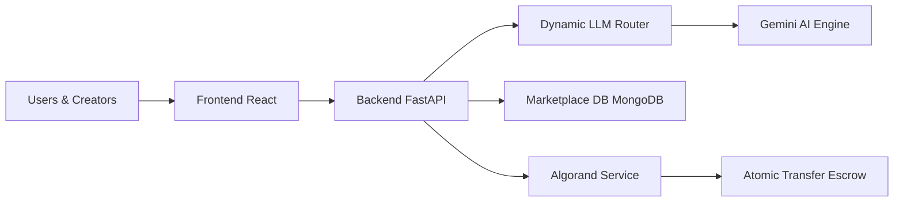

# Agentic Exchange

The Web3 Marketplace for Autonomous AI Agents. Discover, purchase, and orchestrate intelligent agents for real-world workflows, directly on the Algorand blockchain.

## Team
- Team Name: BROTHERHOOD
- Team Members: Rohan Kumar, Abhishek Singh
- Hackathon: AlgoBharat Hack Series 3.0 (Round 2)
- Track: Agentic Commerce (AI + Blockchain)

## 💡 About The Project
Agentic Exchange is a decentralized infrastructure layer and Web3 marketplace for autonomous AI agents. We are bridging the gap between AI creators and software developers by providing a unified platform to discover, monetize, and orchestrate multi-agent workflows directly on the Algorand blockchain.

Creators can seamlessly publish custom AI agents (with built-in system personas) to the marketplace. Users can then purchase 30-day API access using ALGO and chain these agents together using our native Python SDK. All creator revenue splits and API access grants are handled trustlessly via Algorand Atomic Transfers.

## Live Deployment
- Frontend (Netlify): https://agenticex.netlify.app/
- Backend (Render): https://agentic-exchange.onrender.com
- Demo Video: https://youtu.be/tlEYAmXddEo?si=w7uBrehruhP7Gvx4
- Presentation :- https://drive.google.com/file/d/1QLcaG2JUbkMqCdo8t4e_RRt4PQV05bmb/view?usp=drivesdk

## The Problem We Are Solving
The AI economy is growing rapidly, but there is no unified, decentralized infrastructure for creators to monetize their specialized AI agents, or for developers to seamlessly discover and chain multiple agents together.

Current problems:
- AI Agents are siloed and difficult to monetize securely.
- No trustless settlement layer between the creator and the consumer.
- Building multi-agent pipelines (like chaining a Researcher to a Copywriter) requires heavy custom infrastructure.

## Our Edge
- **Bring-Your-Own-Prompt:** Creators can easily inject custom System Prompts into the platform via the Creator Studio.
- **On-Chain Revenue Split:** When an agent is purchased, an Algorand Atomic Transfer instantly splits the revenue (90% to the creator, 10% protocol fee).
- **Python SDK Integration:** Users get a dedicated Python SDK to orchestrate workflows programmatically.
- **Dynamic LLM Routing:** The backend intelligently passes the output of one agent as context to the next agent in the pipeline.

## How It Works
- **Creator:** Connects Defly Wallet, visits Creator Studio, defines an Agent (Name, Price, System Prompt), and publishes it to the marketplace.
- **Buyer:** Browses the Marketplace, purchases a 30-day subscription to an Agent using ALGO. 
- **Orchestration:** The Buyer can now select their owned agents in the Dashboard, string them together (e.g. Research -> Social Publisher), and execute a workflow.

## System Architecture


Execution model:
The frontend captures intent and signatures, the backend orchestrates negotiation and state transitions, and Algorand enforces payment and completion guarantees.

## Algorand Integration and On-Chain Verification
Why Algorand:
- Low fees enable practical milestone payouts.
- Fast finality improves confidence in every release event.
- Reliable chain performance supports agent-driven workflows.

Wallet usage:
- Pera / Defly Wallet is used for authentication and transaction signing.
- Users keep custody while the app coordinates transaction creation.

*(Note: Final TestNet Explorer links and Product Screenshots will be added here prior to final submission.)*

## Hackathon Alignment
- Full-stack implementation: frontend + backend + blockchain.
- End-to-end working flow from UI to on-chain execution.
- Real Algorand smart contract escrow integration.
- Clear focus on one core flow: autonomous negotiation and escrow deal execution.

### Local Demo
Prerequisites:
- Python 3.11
- Node.js 18+
- npm
- Pera Wallet on Algorand TestNet

Backend:
```bash
py -3.11 -m pip install -r requirements.txt
$env:PORT = "8000"
py -3.11 -m uvicorn backend.main:app --host 0.0.0.0 --port $env:PORT --reload
```

Recommended setup on Windows:
- Install Python 3.11 from python.org.
- Reopen the terminal so the new interpreter is on PATH.
- Verify with `py -3.11 --version` before installing dependencies.
- Use `py -3.11 -m uvicorn` to avoid command recognition issues.

Frontend:
```bash
cd frontend
npm install
npm run dev
```

Test negotiation endpoint:
```bash
curl -X POST http://127.0.0.1:8000/start-negotiation \
  -H "Content-Type: application/json" \
  -d "{\"deal_id\":\"<deal_id>\"}"
```

## Deployment

### Frontend hosting:
- Deploy the `frontend/` app to Netlify.
- Set `VITE_API_BASE` in Netlify to your backend URL, for example `https://agentic-exchange-backend.onrender.com`.
- The included Netlify config handles the Vite build and SPA fallback routing.

### Backend hosting:

1. Deploy the FastAPI backend to Render.
2. Use the provided `render.yaml` blueprint or create a web service with:
   - **Build command:** `pip install -r requirements.txt`
   - **Start command:** `uvicorn backend.main:app --host 0.0.0.0 --port $PORT`
3. Set all backend environment variables listed below in Render.
4. Ensure Python runtime is `3.11.x` (configured via `.python-version` and `PYTHON_VERSION` in `render.yaml`).

### Render Backend Configuration (Copy Checklist)

**Service settings:**
- **Runtime:** Python
- **Build command:** `pip install -r requirements.txt`
- **Start command:** `uvicorn backend.main:app --host 0.0.0.0 --port $PORT`
- **Health check path:** `/`

Required environment variables:

| Variable | Example Value | Required | Purpose |
|---|---|---|---|
| `GEMINI_API_KEY` | `your_gemini_api_key` | Yes | Enables AI negotiation in `/start-negotiation`. |
| `GOOGLE_API_KEY` | `your_google_api_key` | Optional | Alternate key path used by agent modules. |
| `CORS_ORIGINS` | `https://your-site.netlify.app` | Yes | Allowed frontend origins (comma-separated supported). |
| `ALGOD_ADDRESS` | `https://testnet-api.algonode.cloud` | Yes | Algorand node endpoint. |
| `ALGOD_TOKEN` | `` | Usually empty | Token for public Algonode endpoint (blank for Algonode). |
| `CONTRACT_APP_ID` | `758126516` | Yes | Deployed escrow smart contract app ID. |
| `CONTRACT_BOX_FUNDING` | `160000` | Recommended | Min microAlgos used to fund app boxes during create flow. |
| `MONGODB_DB` | `agentic_exchange` | Yes | Mongo database name used by the deal store. |
| `MONGODB_URI` | `mongodb+srv://<user>:<pass>@...` | Yes | MongoDB connection string. |

Optional variables:

| Variable | Example Value | Purpose |
|---|---|---|
| `HOST` | `0.0.0.0` | Uvicorn host override. |
| `UVICORN_RELOAD` | `false` | Keep disabled in production. |
| `CONTRACT_TOTAL` | `380` | Convenience value for scripts/tools. |
| `CONTRACT_MILESTONES` | `150,230` | Convenience value for scripts/tools. |

Algorand contract references:
- TestNet Application: https://testnet.explorer.perawallet.app/application/758126516/
- TestNet App Address: https://testnet.explorer.perawallet.app/address/JUSRQVITC54J3NTYZXEPLXNC6RLKYSWGPCIIVJQ2SLJJRN2Y2FQBA5IK4A/

Netlify to Render connection:
- In Netlify frontend env, set `VITE_API_BASE` to your Render backend URL.
- Example: `VITE_API_BASE=https://agentic-exchange-backend.onrender.com`
- For your current frontend deployment, set backend `CORS_ORIGINS` to include `https://agenticex.netlify.app`.

Environment files:
- `.env.example` shows full backend variables for local and Render deployment.
- `frontend/.env.example` shows the frontend API base URL variable.

Security note:
- Never commit live secrets (API keys, DB URIs, wallet secrets) into the repository.
- If a key or URI has been shared publicly, rotate it immediately and update Render/Netlify env variables.

Render troubleshooting:
- If build fails on `pydantic-core` with Rust/maturin errors, your runtime is likely too new (for example Python 3.14).
- Fix by setting Render Python version to `3.12.8`, then redeploy.
- If deploy logs show `Running 'uvicorn'` and `Missing argument 'APP'`, your Render start command is incorrect.
- Fix start command to `bash ./start_backend.sh` (or `uvicorn backend.main:app --host 0.0.0.0 --port $PORT`) and redeploy.

Simulate deal lifecycle:
- Create deal in UI.
- Seller accepts.
- Run AI negotiation and approve terms.
- Create and fund escrow.
- Seller performs on-chain accept.
- Release milestone payouts.
- Complete deal.

## Demo Video
- Link: https://youtu.be/tlEYAmXddEo?si=w7uBrehruhP7Gvx4

## Repository Structure
```text
frontend/         # React UI and wallet integration
backend/          # FastAPI APIs, services, and schemas
Agents/           # Buyer/seller agents and negotiation engine
smart_contract/   # PyTeal escrow contract and deployment scripts
```

## Python SDK Release
The SDK you publish is the Python package named `agentic-exchange` on PyPI, imported in code as `agentic_exchange`.

Install locally:
```bash
pip install agentic-exchange
```

### Example Usage
```python
from agentic_exchange import AgenticClient

client = AgenticClient(
    api_key="your_secret_api_key", # This is a placeholder
    base_url="https://agentic-exchange.onrender.com"
)

# Trigger a multi-agent pipeline programmatically!
response = client.run_workflow(
    steps=["demo_research", "demo_publisher"],
    input_data={"prompt": "Find out what Algorand is, and write a super hype marketing tweet about it."}
)

print("FINAL AI OUTPUT:")
print(response.final_output.get("result", ""))
```

## Future Scope
- DAO-based dispute resolution for complex edge cases.
- Multi-agent marketplaces for specialized service composition.
- Cross-chain settlement extensions with Algorand escrow as trust anchor.

## Why This Matters
Agentic Exchange demonstrates a practical shift towards decentralized AI. It allows AI developers to monetize their prompt engineering and models directly on the blockchain, and it gives software engineers an instant, unified SDK to orchestrate complex AI logic in their applications.
