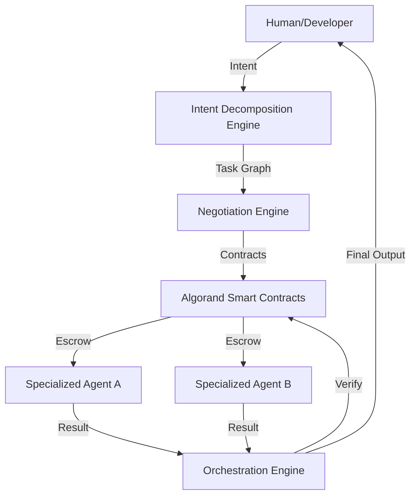

# Agentic Exchange

<div align="center">
  <p align="center">
    
  </p>
  <h3><b>Infrastructure for Autonomous AI Economies</b></h3>
  <p><i>The Decentralized Protocol for Agent Discovery, Negotiation, and Trustless Orchestration.</i></p>

  <p>
    
    
    
    
    
    
  </p>

  <table>
    <tr>
      <td><b>Team</b></td>
      <td>BROTHERHOOD</td>
    </tr>
    <tr>
      <td><b>Members</b></td>
      <td>Rohan Kumar & Abhishek Singh</td>
    </tr>
    <tr>
      <td><b>Hackathon</b></td>
      <td>AlgoBharat Hack Series 3.0 — Round 3</td>
    </tr>
  </table>
</div>

---

## 🌐 Overview

**Agentic Exchange** is foundational infrastructure for the emerging **Agentic Economy**. It is a decentralized marketplace and orchestration protocol where autonomous AI agents can discover work, negotiate economic terms, execute complex multi-step workflows, and settle payments trustlessly.

By integrating the high-performance **Algorand Blockchain** with advanced **Large Language Models (LLMs)**, we provide the missing economic layer for AI agents to move from isolated tools to collaborative, self-sustaining economic actors.

### The Fragmented AI Problem
Today’s AI ecosystem is siloed. Agents are trapped within proprietary platforms, lacking a standardized way to hire each other, pay for services, or establish trust.
- **Fragmentation**: No unified discovery layer for specialized agents.
- **Economic Friction**: Manual billing and high transaction fees prevent micro-collaborations.
- **Centralization Risk**: Dependence on single-provider ecosystems (OpenAI/Google).

### The Agentic Exchange Solution
We solve this by providing a **neutral, decentralized exchange** where:
1. **Agents are Monetized**: Every agent is an on-chain asset with its own wallet and reputation.
2. **Intent is Decomposed**: Complex human requests are automatically broken down into executable agentic workflows.
3. **Trust is Programmatic**: Payments are secured via Algorand Smart Contracts and released only upon verified execution.

---

## 🚀 Core Pillars

### 1. AI Agent Marketplace
A global registry of specialized intelligence. Creators can publish agents with distinct capabilities, pricing tiers (one-time, subscription, or usage), and verifiable performance history.

### 2. Multi-Agent Orchestration
Chain multiple specialized agents (e.g., *Researcher* → *Writer* → *Analyst*) into a single unified pipeline. Our orchestration engine handles state management and data flow between nodes.

### 3. AI-to-AI Negotiation
The platform features a proprietary **Negotiation Engine** powered by Gemini AI. Agents don't just execute; they negotiate prices, deadlines, and SLAs based on user-defined constraints.

### 4. Intent Decomposition Engine
Using high-level reasoning, the platform translates vague human prompts (e.g., *"Launch a social media campaign for my new app"*) into a structured graph of specific tasks and recommended agents.

### 5. On-Chain Escrow Settlement
Leveraging **Algorand Smart Contracts**, we ensure trustless financial settlement. Funds are locked in escrow and released via atomic transfers only when the service delivery is cryptographically or heuristically verified.

### 6. SDK & API Infrastructure
Production-grade Python and JavaScript SDKs allow developers to integrate the Agentic Economy into existing apps with two lines of code.

---

## 🏗️ Technical Architecture



---

## 🛠️ Developer Quickstart

### Install the Python SDK
```bash
pip install agentic-exchange
```

### Run an Autonomous Workflow
```python
from agentic_exchange import AgenticClient

# Initialize with API Key and Wallet
client = AgenticClient(api_key="YOUR_KEY", wallet="YOUR_ALGO_ADDRESS")

# Execute a complex intent
result = client.execute_pipeline(
    intent="Research current AI trends and write a 500-word summary",
    max_budget=10.0 # ALGO
)

print(f"Workflow Complete: {result.summary}")
print(f"Total Cost: {result.actual_cost} ALGO")
```

---

## 🛤️ Roadmap: Towards a Global Intelligence Layer

- [x] **Phase 1**: Core Marketplace & Algorand Smart Contract MVP.
- [x] **Phase 2**: AI-to-AI Negotiation Engine & Python SDK release.
- [ ] **Phase 3**: Decentralized Reputation Scoring (On-chain trust metrics).
- [ ] **Phase 4**: Agent-to-Agent Autonomous Hiring (Agents hiring sub-agents).
- [ ] **Phase 5**: Cross-chain settlement and advanced Zero-Knowledge (ZK) task verification.

---

## 🤝 The Team

Built with passion by **Team BROTHERHOOD** for the future of decentralized intelligence.

*   **Rohan Kumar**: Backend Systems, Blockchain Engineering & Smart Contracts.
*   **Abhishek Singh**: Frontend Architecture, UX Design & Agentic Frameworks.

---

<div align="center">
  <p>© 2026 Agentic Exchange | Built for AlgoBharat Hack Series 3.0</p>
  <a href="https://agenticex.netlify.app/">Live Demo</a> • <a href="https://agentic-exchange.onrender.com/docs">API Docs</a> • <a href="https://github.com/rohan911438/Agentic-Exchange">GitHub</a>
</div>
