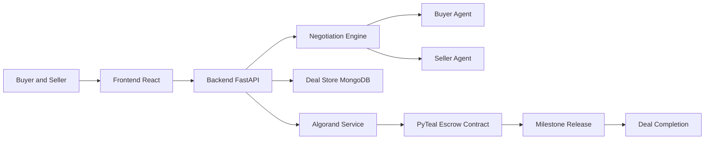
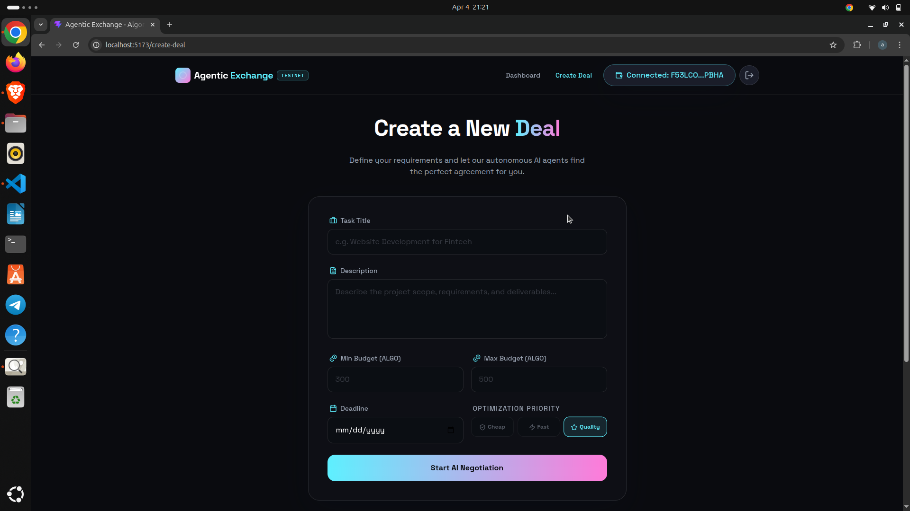

# Agentic Exchange

AI agents negotiate. Algorand secures. Commerce executes itself.

## Team
- Team Name: BROTHERHOOD
- Team Members: Rohan Kumar, Abhishek Singh
- Hackathon: AlgoBharat Hack Series 3.0 (Round 2)
- Track: Agentic Commerce (AI + Blockchain)

## What We Built
Agentic Exchange is a full-stack agentic commerce platform where users do not manually negotiate every term. Instead, a buyer agent and seller agent autonomously negotiate price, milestones, and timeline, then execute the finalized agreement through Algorand smart contract escrow.

Core execution flow:
UI -> AI negotiation -> on-chain escrow -> milestone release -> completion

## The Problem We Are Solving
Digital service marketplaces are still inefficient and trust-heavy.

What breaks in current systems:
- Manual negotiation creates delay and decision fatigue.
- Verbal or off-platform agreements are hard to enforce.
- Payments are either high-risk upfront or delayed with friction.
- Multi-milestone projects often lead to disputes over who owes what and when.

The real user pain is not just finding talent or clients. The pain is converting intent into a reliable, executable agreement.

## Why Existing Platforms Are Not Enough
Most peers solve one piece of the puzzle, not the full lifecycle.

| Platform Type | Negotiation | Settlement | Trust Layer | End-to-End Automation |
|---|---|---|---|---|
| Traditional freelance marketplaces | Mostly manual chat | Centralized payout | Platform-mediated | Partial |
| Escrow-only crypto tools | Manual off-platform | On-chain escrow | Smart contract only | No |
| AI assistant products | Suggestive drafting | No native settlement | No enforced execution | No |
| Agentic Exchange | Autonomous multi-agent bargaining | On-chain milestone escrow | Cryptographic + programmable | Yes |

## Our Edge
- We combine AI negotiation and blockchain execution in one integrated product.
- We focus on one complete high-value loop instead of many disconnected features.
- We enforce negotiated outcomes with on-chain milestone settlement.
- We reduce both coordination cost and trust risk at the same time.

## How It Works
- Buyer creates a deal request from the frontend.
- Seller accepts and negotiation begins.
- Buyer and seller agents negotiate in natural language.
- Final terms are approved and converted into escrow actions.
- Buyer creates and funds Algorand escrow.
- Seller confirms participation on-chain.
- Milestones are released progressively on verified progress.
- Deal is completed after full settlement.

## System Architecture


Execution model:
The frontend captures intent and signatures, the backend orchestrates negotiation and state transitions, and Algorand enforces payment and completion guarantees.

## Algorand Integration and On-Chain Verification
Why Algorand:
- Low fees enable practical milestone payouts.
- Fast finality improves confidence in every release event.
- Reliable chain performance supports agent-driven workflows.

Wallet usage:
- Pera Wallet is used for authentication and transaction signing.
- Users keep custody while the app coordinates transaction creation.

Verify on-chain deployment:
- Pera Explorer TestNet Application: https://testnet.explorer.perawallet.app/application/758126516/
- Pera Explorer TestNet Application Address: https://testnet.explorer.perawallet.app/address/JUSRQVITC54J3NTYZXEPLXNC6RLKYSWGPCIIVJQ2SLJJRN2Y2FQBA5IK4A/
- AlgoExplorer TestNet Application: https://testnet.algoexplorer.io/application/758126516
- AlgoExplorer TestNet Address: https://testnet.algoexplorer.io/address/JUSRQVITC54J3NTYZXEPLXNC6RLKYSWGPCIIVJQ2SLJJRN2Y2FQBA5IK4A

Demo wallet/account used (TestNet):
- Pera Explorer TestNet Account: https://testnet.explorer.perawallet.app/address/NVOMGL2X2F5NP3JLC66EFU45LKQJWFNFQZHSUWFTXBQZ4KQJQJ6K7EM6WA/
- Pera Explorer TestNet Transactions: https://testnet.explorer.perawallet.app/transactions/?transaction_list_address=NVOMGL2X2F5NP3JLC66EFU45LKQJWFNFQZHSUWFTXBQZ4KQJQJ6K7EM6WA

## Product Screenshots
All screenshots are loaded from one path: docs/images

!(docs/images/landing.png)




## Hackathon Alignment
- Full-stack implementation: frontend + backend + blockchain.
- End-to-end working flow from UI to on-chain execution.
- Real Algorand smart contract escrow integration.
- Clear focus on one core flow: autonomous negotiation and escrow deal execution.

## Local Demo
Prerequisites:
- Python 3.10+
- Node.js 18+
- npm
- Pera Wallet on Algorand TestNet

Backend:
```bash
pip install -r requirements.txt
uvicorn backend.main:app --reload
```

Frontend:
```bash
cd frontend
npm install
npm run dev
```

Test negotiation endpoint:
```bash
curl -X POST http://127.0.0.1:8000/start-negotiation \
  -H "Content-Type: application/json" \
  -d "{\"deal_id\":\"<deal_id>\"}"
```

Simulate deal lifecycle:
- Create deal in UI.
- Seller accepts.
- Run AI negotiation and approve terms.
- Create and fund escrow.
- Seller performs on-chain accept.
- Release milestone payouts.
- Complete deal.

## Demo Video
- Link: https://youtu.be/your-demo-link

## Repository Structure
```text
frontend/         # React UI and wallet integration
backend/          # FastAPI APIs, services, and schemas
Agents/           # Buyer/seller agents and negotiation engine
smart_contract/   # PyTeal escrow contract and deployment scripts
```

Naming note:
- agents/ in documentation maps to Agents/ in this repository.
- contracts/ in documentation maps to smart_contract/ in this repository.

## Future Scope
- Fully autonomous agents with memory and strategy adaptation.
- DAO-based dispute resolution for complex edge cases.
- Multi-agent marketplaces for specialized service composition.
- Cross-chain settlement extensions with Algorand escrow as trust anchor.

## Why This Matters
Agentic Exchange demonstrates a practical shift from chat-based contracting to executable digital agreements. It reduces negotiation friction, hardens payment trust through smart contracts, and proves how AI agents can participate in real economic workflows with verifiable on-chain settlement.
